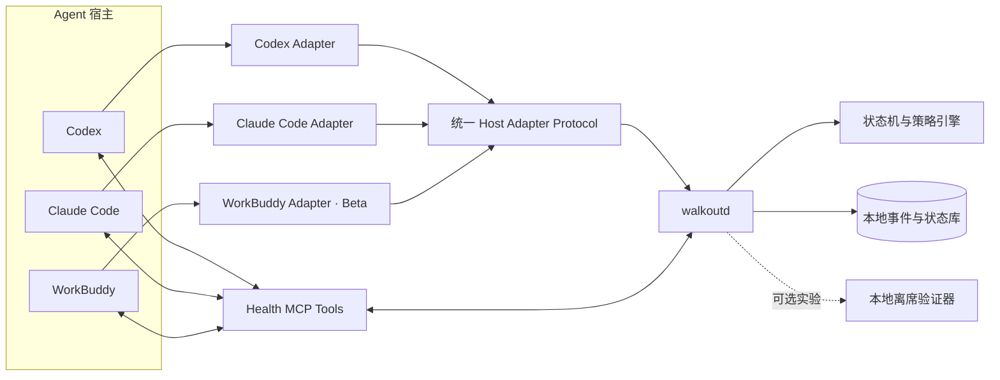

# Walkout 第一版逻辑架构

> **AI 辅助与人工审核声明**：本文由 AI 辅助起草，并由产品负责人进行人工审核。涉及健康建议、隐私政策和正式发布时，还应完成相应的专业复核。

本文版本基于 **2026-08-05** 可获得的 Codex、Claude Code 与 WorkBuddy 官方资料。第一版同时兼容三个宿主，采用“**一个共享健康核心 + 三个薄适配器**”的架构，避免为每个 Agent 复制一套计时、债务和隐私逻辑。

本文中的 Agent 是通用知识工作 Agent。目标场景包含法律、会计与财务、设计、研究、运营、咨询、行政、管理和软件开发。三个宿主是技术接入面，不是用户职业或任务类型的边界。

第一版的交付取舍以 `v1-scope.md` 为准。本文描述逻辑关系；超出核心闭环的组件不因此自动成为发布项。

## 1. 架构结论

第一版核心由五个逻辑部分组成，另有一个可选实验：

1. **宿主适配器**：把 Codex、Claude Code、WorkBuddy 的生命周期事件转换成统一事件；
2. **Agent 上下文评估协议**：利用当前 Agent 已拥有的工作上下文判断是否适合立即打断；
3. **`walkoutd` 健康核心**：在本机统一计算连续工作、健康债务、状态迁移和并发会话；
4. **干预策略引擎**：决定提醒、延期、保护窗口、暂停与恢复；
5. **健康控制面**：提供状态、延期、休息、紧急继续和恢复命令，在暂停状态下仍可使用；
6. **可选本地离席验证器**：作为 bounded spike，按次使用摄像头，只输出在场、离场或不确定及持续时间。

逻辑关系如下：



三个适配器只负责“翻译”和“执行宿主决定”。时间和健康债务由 `walkoutd` 统一计算；工作是否紧急由当前 Agent 结构化评估；最终是否延期由确定性策略裁决。

## 2. 设计原则

### 2.1 共享规则只有一份

默认参数沿用产品规格：

- 正常工作间隔：45 分钟；
- 温和提醒后的宽限期：5 分钟；
- 普通延后：10 分钟；
- 健康债务上限：120 分钟；
- 人类交互窗口：默认 5 分钟，可配置；
- 离开画面验证：连续 20 秒；
- 紧急继续：15 分钟。

适配器不得自行计算这些阈值，也不得维护独立状态机。这样用户同时打开多个 Agent 时，连续工作时间按真实时间区间合并，避免三倍累计，也避免在三个窗口里分别欠债。

### 2.2 语义判断与机械约束分层

当前 Agent 最了解正在进行的工作，适合判断“现在离开是否会破坏任务”；daemon 更适合可靠地计时、去重和限制延期次数。二者通过 `health.assess` 协作：

```text
Agent 理解当前自然语言上下文并提交结构化判断
            ↓
walkoutd 校验 schema、时限、状态和历史延期
            ↓
返回版本化 HealthDecision
            ↓
适配器执行 allow / require_assessment / inject_reminder / pause_prompt / fail_open
```

Agent 的判断是策略输入，不能直接解除健康债务或无限延期。daemon 不运行第二个 LLM，也不负责理解 Agent 传入的任意自然语言。它只使用枚举、数值、布尔值、时间戳和当前状态执行版本化确定性策略；相同状态、配置和结构化输入必须得到相同结果。脱敏自然语言字段只能作为展示素材，不能批准延期、解除暂停、清除债务或完成恢复。

### 2.3 在安全边界暂停

Hook 无法保证在任意时刻插入正在生成的回答。第一版在 turn 边界执行干预，tool 事件只作为活动心跳：

- 当前操作允许完成到可恢复检查点；
- 当前 turn 结束后，下一条普通提示词可被暂停；
- 保存、导出、查看恢复说明、健康控制、紧急和无障碍能力继续可用；
- daemon 故障时采用 fail-open，保留 Agent 主要能力并提示健康保护暂不可用。

### 2.4 上下文最小化

Agent 可以利用当前对话，但 daemon 默认不接收或保存原始聊天。它只接收结构化结论和可选的脱敏展示素材。展示素材只做长度、格式和敏感标记等机械校验，不参与策略；敏感任务可以设置 `context_sensitive=true`，此时提醒只引用任务阶段，不引用案件、客户、财务数据、设计资产、项目、文件或故障细节。

### 2.5 Agent 运行时间与人的参与时间分离

`walkoutd` 同时维护两种时间，二者不能混用：

| 时间 | 含义 | 是否计入连续久坐 |
| --- | --- | --- |
| `agent_runtime` | 某个 Agent session 正在生成、调用工具或等待后台任务 | 否 |
| `inferred_human_engagement` | 最近一个可配置窗口内，用户与至少一个 Agent 发生过可确认交互；默认窗口为 5 分钟 | 是，但属于估计值 |

V1 不要求用户声明离开或返回。每一个可靠的人类交互事件在时间点 `hᵢ` 打开一个长度为 `interaction_window_minutes` 的窗口，默认 5 分钟：

```text
inferred_human_engagement
  = union([h₁, h₁ + interaction_window_minutes], [h₂, h₂ + interaction_window_minutes], ...)
```

窗口内继续计时；全局连续一个完整窗口没有新的人类交互后，窗口到期并暂停计时。下一次任意 session 的人类交互自动打开新窗口，计时从原累计值继续。

空闲窗口到期只执行“暂停累计”，不自动清零连续工作时间，也不偿还健康债务。这样可以避免把长时间阅读、开会或转去其他应用误判为已经完成健康休息。

V1 只把以下事件视为人类交互：

- `UserPromptSubmit`；
- 宿主能够明确标记为用户本人完成的健康操作或交互响应。

以下事件永远不能续期人的窗口：

- `SessionStart` / `SessionEnd`；
- `PreToolUse` / `PostToolUse`；
- Agent 流式输出、Stop、后台任务和完成通知；
- subagent 的任何活动。

窗口长度由可配置参数 `interaction_window_minutes` 控制，默认 5 分钟，属于行为推断参数而非医学阈值。窗口太短会漏算用户长时间阅读或审阅，太长会在用户已经离开时继续计时；后续可以用录制事件回放比较 3、5、10 分钟并调整默认值。

### 2.6 多 session 只使用时间并集

健康状态属于本机用户，不属于某个项目或对话。所有 session 的人类交互事件进入同一条用户级时间线：

```text
global_inferred_engagement
  = union(all sessions' [human_event, human_event + interaction_window_minutes])
```

多个窗口重叠时只计算一次，不按 session 相加。Agent 可以在一个或多个 session 中持续运行；只要所有 session 都超过配置窗口没有人类交互，人的计时就暂停。

daemon 保存 `last_human_interaction_at` 和 `last_human_session_id`。提醒使用全局唯一的 `intervention_id`，由最近收到人类交互的 session 作为 `reminder_owner`。其他 session 不重复提醒。所有窗口均已到期时，提醒排队到下一次人类交互，不能插入后台 Agent 的完成消息。全局进入 `walkout` 后，所有 session 的下一条普通请求都会暂停；真实紧急任务可以获得绑定 `session_id` 的有限 `protected_window`，该租约不能解锁其他无关 session。

两个关键场景的事件链：

```text
场景 A：用户脱手离开（使用默认 5 分钟窗口）
10:00 用户在 session A 提交任务 → 人的窗口开放到 10:05
10:01–10:20 Agent A 持续调用工具 → 只更新 agent_runtime
10:05 仍无任何用户交互 → 人的计时暂停
10:20 Agent A 完成 → 不续期计时，不插入健康提醒
10:30 用户再次提交提示词 → 打开新的参与窗口并恢复计时

场景 B：多个 Agent 并行
10:00 用户与 session A 交互 → 窗口到 10:05
10:03 用户与 session B 交互 → 全局窗口延长到 10:08
10:04–10:20 A、B 都在运行工具 → 不产生新的人的窗口
→ 10:00–10:08 总计 8 分钟，不是 16 分钟
→ 达到健康阈值时，B 是 reminder_owner；A 不重复提醒
```

## 3. 组件职责

### 3.1 Host Adapter：宿主适配器

每个适配器包含：

- lifecycle hook 配置；
- 一个轻量本地 hook runner；
- Health MCP Server 注册；
- 宿主专用的提示词阻止、追加上下文和继续执行映射；
- 安装检查、版本检查与诊断命令。

适配器不拥有业务状态。即使某个宿主升级导致 hook 字段变化，也只需要修改该适配器和契约测试。

### 3.2 `walkoutd`：健康核心

`walkoutd` 是用户级本地进程，职责包括：

- 注册和关闭 Agent session；
- 合并多个 session 的人类参与时间区间；
- 执行三态状态机（`working → overtime → walkout`，2026-08-26 简化裁定）；
- 记录提醒、跳过、紧急继续和离席事件；
- 生成每个 hook 节点的确定性决定；
- 管理无摄像头恢复路径，并可选启动本地离席验证；
- 在各 hook 查询时返回版本化状态。

V1 首个验证平台使用 Windows named pipe。localhost HTTP 可以作为开发期替代，但需要随机鉴权令牌并限制为 loopback；Unix domain socket 留到 macOS 或 Linux 适配阶段。

#### 3.2.1 本地 RPC envelope

named pipe 与后续 Unix domain socket 共用 UTF-8 NDJSON 协议：每行一个请求，daemon 对每行返回一个响应。默认单行上限为 64 KiB；超限行会被丢弃并返回结构化错误，同一连接可以继续处理下一行。

请求 envelope 固定为：

```json
{
  "schema_version": "1.0",
  "request_id": "caller-generated-id",
  "operation": "status | process_event | execute_command",
  "payload": {}
}
```

三种 operation 的 payload：

- `status`：空对象；只读取最后一次已提交状态，不创建事件或推进计时；
- `process_event`：`event` 为完整 `HealthEvent`，`assessment_status` 为 `missing | safe_now | finish_current_step`；
- `execute_command`：完整 `HealthControlCommand`，V1 支持 `confirm_activity`（用户反馈已活动，单步清零）和 `emergency_continue`。

响应 envelope 固定为：

```json
{
  "schema_version": "1.0",
  "request_id": "caller-generated-id",
  "ok": true,
  "payload": {},
  "error": null
}
```

失败响应使用 `ok=false`、`payload=null` 和以下机器可读错误码：

- `invalid_request`：envelope 为空、JSON 畸形、schema 或必需字段无效；
- `request_too_large`：单行超过大小上限；
- `unsupported_operation`：operation 未实现；
- `invalid_payload`：operation payload 的结构或业务输入无效；
- `business_rejected`：请求结构有效，但当前健康状态不允许该操作；
- `internal_error`：daemon 内部或持久化故障。

解析采用严格字段校验，错误响应不回显被拒绝的 payload、底层错误、堆栈或本地路径。单行协议或业务失败不关闭连接。适配器无法连接 daemon，或收到 `internal_error` 时，仍按既定策略 fail-open；RPC 层不自行生成宿主 hook 输出。

### 3.3 Health MCP Server：上下文桥梁

MCP 工具让主 Agent 在拥有当前对话上下文时提交判断：

| 工具 | 用途 | 暂停时是否可用 |
| --- | --- | --- |
| `health.status` | 获取连续工作、债务、当前状态与下一检查点 | 是 |
| `health.assess` | 提交当前任务的可打断性和脱敏提醒素材 | 是 |
| `health.confirm_activity` | 用户反馈已活动；单步清零本轮时间与债务 | 是 |
| `health.emergency_continue` | 请求 15 分钟紧急继续并记录原因分类 | 是 |
| `health.resume` | 查询当前恢复结果并同步 session | 是 |

MCP 调用经过 daemon 验证，Agent 无法通过伪造参数重置债务。

### 3.4 Context Assessment：上下文评估

`health.assess` 的第一版输入：

```json
{
  "schema_version": "1.0",
  "session_id": "host-session-id",
  "turn_id": "host-turn-id",
  "urgency": "normal | critical",
  "interruptibility": "safe_now | finish_current_step",
  "work_mode": "drafting | review | calculation | design | research | live_communication | software_work | other",
  "breakpoint_kind": "now | after_current_step | after_external_commit | after_live_session | other",
  "estimated_minutes": 3,
  "reason_code": "ordinary_work | external_deadline | live_session | irreversible_operation | incident_response | presentation | accessibility | personal_safety",
  "context_sensitive": false,
  "safe_breakpoint_label": "当前批次保存完成后",
  "reminder_seed": "当前批次还需约三分钟保存"
}
```

约束：

- `work_mode`、`urgency`、`interruptibility`、`breakpoint_kind`、`estimated_minutes`、`reason_code` 和 `context_sensitive` 是策略字段；
- `safe_breakpoint_label` 与 `reminder_seed` 必须脱敏，只能用于展示，不参与策略；
- `work_mode` 只描述工作交互形态，不保存职业、客户、案件或项目身份；
- `estimated_minutes` 只能帮助安排短保护窗口，不能直接成为批准时长；
- `critical` 必须配合允许的 `reason_code`；
- 普通写作、审阅、核对、设计、研究、编码或“快做完了”不能标记为 `critical`；
- daemon 只批准有固定截止时间的短保护窗口，并向用户展示手动出口。

如果 Agent 只提交自然语言而缺少必需的结构化策略字段，daemon 不猜测其含义：评估请求应被拒绝或回退到保守默认动作。自然语言展示字段默认不持久化；确需跨 hook 暂存时，应使用短生命周期并遵守 `context_sensitive`。

V1 的确定性策略可以表达为：

```text
如果适配器无法连接 daemon → 适配器合成 fail_open
否则如果 schema 不兼容 → fail_open
否则如果全局状态为 walkout → pause_prompt（有效紧急 lease 时 allow）
否则如果全局状态为 overtime → inject_reminder（放行并注入提醒；评估存在时仅影响提醒措辞与停顿点建议）
否则 → allow
```

> 2026-08-26 简化裁定：提醒触发不依赖评估。`health.assess` 是可选增强——评估在场时提醒可以更贴工作语境，缺席时提醒照发；`require_assessment` 不再出现在 V1 决策路径。

`work_mode` 用来寻找合适的安全停顿点和提醒方式：

| 工作形态 | 可能的安全停顿点 | 上下文提醒机会 |
| --- | --- | --- |
| 法律与文档审阅 | 当前条款完成、批注保存、提交窗口明确 | 在下一条款前离席 |
| 会计与财务 | 当前账务批次完成、公式重算结束、报表导出 | 在批次之间离席 |
| 视觉与内容设计 | 画布保存、渲染或导出开始 | 利用等待时间离席 |
| 研究与分析 | 来源记录、结论写入笔记、查询完成 | 在切换研究问题前离席 |
| 运营、咨询与行政 | 消息或方案草稿保存、客户会话结束 | 在下一沟通动作前离席 |
| 软件工作 | 构建、测试、部署或回滚到达安全节点 | 利用运行时间或检查点离席 |

职业名称不能直接决定紧急程度。同一种工作既可能普通，也可能受到法定截止时间、实时客户会话或不可逆操作的约束。

### 3.5 Verification Service：可选本地离席验证

验证器不属于基础版本的发布门槛。若 bounded spike 进入实验，它独立于 Agent 宿主，以免三个插件分别请求摄像头权限，并且只输出：

```json
{
  "result": "present | absent | uncertain",
  "continuous_absence_seconds": 23,
  "verified_at": "RFC3339 timestamp"
}
```

边界固定为：本地处理、不上传、不录制、不做人脸识别；基础版本始终提供无摄像头替代；产品只在摄像头实验成功时声称“离开画面 20 秒”，不声称用户已经喝水。

## 4. 统一事件协议

三个适配器向 daemon 发送相同的 `HealthEvent`：

```json
{
  "schema_version": "1.0",
  "event_id": "uuid",
  "provider": "codex | claude_code | workbuddy",
  "host_version": "string",
  "session_id": "string",
  "turn_id": "string-or-null",
  "tool_call_id": "string-or-null",
  "event_type": "session_start | prompt_submit | pre_tool | post_tool | stop | session_end",
  "occurred_at": "RFC3339 timestamp",
  "activity_kind": "human_input | agent_work | tool_work | session_lifecycle",
  "capabilities": ["block_prompt", "continue_after_stop", "inject_context", "tool_heartbeat"],
  "payload": {}
}
```

协议规则：

- `event_id` 全局唯一；
- daemon 使用 `provider + session_id + turn_id + event_type + tool_call_id` 幂等去重；
- `payload` 默认不包含原始提示词、工具参数、工具输出或 transcript 路径；
- 适配器启动时上报 capability，daemon 按能力降级，不能仅凭宿主名称猜测；
- 未识别的 schema major version 拒绝进入强暂停，只保留提醒，防止错误锁定。

### 4.1 `HealthDecision`：daemon 的统一返回

`HealthDecision` 不是任何单一宿主的原生 API，而是 `walkoutd` 返回给适配器的内部统一协议。它回答“这个 hook 节点现在应执行什么动作”，避免三个适配器复制状态机和债务规则。只有在 daemon 不可达时，适配器可以合成一个 `action=fail_open` 的本地决定以保留主要 Agent 能力。

```json
{
  "schema_version": "1.0",
  "decision_id": "uuid",
  "source_event_id": "uuid",
  "state_revision": 42,
  "state": "working | overtime | walkout",
  "action": "allow | require_assessment | inject_reminder | pause_prompt | fail_open",
  "reason_code": "not_due | break_due | assessment_required | protected_window | debt_limit | daemon_unavailable | schema_incompatible",
  "intervention_id": "uuid-or-null",
  "protected_until": "RFC3339-timestamp-or-null",
  "next_check_at": "RFC3339-timestamp-or-null"
}
```

规则：

- `source_event_id` 把决定绑定到触发它的 `HealthEvent`；
- `state_revision` 防止适配器执行过期决定；
- `action` 每次只给出一个主要动作；
- `intervention_id` 用于跨 session 提醒去重；
- `protected_until` 只能由 daemon 根据确定性策略签发；
- `fail_open` 只用于 daemon 不可达、schema 不兼容或安全降级，不能被普通业务规则选中；
- `HealthDecision` 不包含需要 daemon 理解的自由文本；提醒文案由当前主 Agent 结合对话生成，适配器在无法调用 Agent 时使用固定安全模板兜底；
- 每个宿主适配器负责把统一 action 映射为该宿主实际支持的 stdout JSON、上下文注入或退出码。

## 5. 生命周期事件映射

| 统一事件 | Codex | Claude Code | WorkBuddy / CodeBuddy | 第一版用途 |
| --- | --- | --- | --- | --- |
| `session_start` | `SessionStart` | `SessionStart` | `SessionStart` | 注册会话、注入健康协议摘要 |
| `prompt_submit` | `UserPromptSubmit` | `UserPromptSubmit` | `UserPromptSubmit` | 登记人工活动、检查暂停、注入提醒上下文 |
| `pre_tool` | `PreToolUse` | `PreToolUse` | `PreToolUse` | 只更新 Agent runtime，不能续期人的计时窗口 |
| `post_tool` | `PostToolUse` | `PostToolUse` | `PostToolUse` | 更新 Agent runtime；通用完成信号可作为提醒线索 |
| `stop` | `Stop` | `Stop` | `Stop` | 要求上下文评估，确保提醒进入真实对话 |
| `session_end` | `SessionEnd` | `SessionEnd` | `SessionEnd` | 关闭会话，停止继续计时 |

第一版不把 Claude Code 的 `MessageDisplay`、WorkBuddy 的专有 UI 事件或 Codex App Server 当成主链路。这些能力可用于后续体验增强，核心行为仍由六个共有事件保证。

### 5.1 兼容性判断

| 能力 | Codex | Claude Code | WorkBuddy |
| --- | --- | --- | --- |
| 插件打包 hooks 与 MCP | 文档可行，需目标版本实测 | 文档可行，需目标版本实测 | 文档可行，需桌面端实测 |
| 提示词提交前注入或阻止 | `0.147.0` 已实测 `UserPromptSubmit` 输入与 `decision=block`；上下文注入和交互界面输入保留待测 | 待实测具体行为 | 待实测具体行为 |
| 工具事件心跳 | 待实测事件字段与时序 | 待实测事件字段与时序 | 待实测事件字段与时序 |
| Stop 时要求 Agent 继续 | 待实测 continuation 行为 | 待实测 continuation 行为 | 待实测 continuation 行为 |
| 任意时刻插入正在生成的对话 | hooks 不保证 | hooks 不保证 | hooks 不保证 |
| 第一版目标支持级别 | 通过验收后稳定 | 通过验收后稳定 | Beta 适配器 |

### 5.2 Codex `0.147.0` capability probe

2026-08-08 在 Windows x64 上用受控、无敏感内容的 `codex exec --ephemeral` 会话采集了真实 hook 输入，并把脱敏 fixture 固定在 contract tests。结果如下：

- `SessionStart`、`UserPromptSubmit`、`Stop`、`SessionEnd` 均实际触发；
- `SessionStart` 与 `SessionEnd` 没有 `turn_id`，`UserPromptSubmit` 与 `Stop` 有 `turn_id`；
- ephemeral 会话的 `transcript_path` 为 `null`，适配器不能把 transcript 当作必填或稳定接口；
- 实际 `SessionEnd` 没有 `model` 与 `permission_mode`，因此这两个字段只能作为可选诊断输入；
- `UserPromptSubmit` 含完整 prompt，`Stop` 含最后一条 assistant message；适配器只用字段是否存在做契约校验，不把正文、cwd、model 或 transcript 路径放入 `HealthEvent`；
- 返回 `{"decision":"block"}` 后 Codex 明确报告 `UserPromptSubmit Blocked`，证明 `block_prompt` 可用；
- 被阻止的非交互 `codex exec` 在 30 秒内没有自行退出。交互界面的输入保留、transcript 表现、无损重试、上下文注入以及 Stop continuation 仍需单独实测。

这次 probe 只把 `block_prompt` 标为已验证 capability；其余能力继续由运行时 probe 或显式配置提供，适配器不能仅根据 provider 名称宣称可用。

WorkBuddy 在 5.3.5 版本加入“扩展插件 Hook”，当前公开的详细 hook 契约位于 CodeBuddy Code 文档，且官方标记为 Beta。第一版因此把 WorkBuddy 纳入正式架构和验收范围，同时设置独立兼容层、最低版本检查和运行时 capability probe。发布前必须在 WorkBuddy Desktop 完成真实安装测试，不能只凭 CodeBuddy CLI 文档宣称完全兼容。

Windows 上的 WorkBuddy / CodeBuddy command hook 由 Git Bash 执行，脚本需使用 Bash 兼容语法；daemon 本体继续使用原生 Windows 进程与 named pipe。

## 6. 唯一状态机

状态机严格沿用 `product-spec.md`（2026-08-26 三态简化裁定）：

```text
working → overtime → walkout → working
```

| 状态 | 核心含义 | 宿主行为 |
| --- | --- | --- |
| `working` | 正常工作计时 | 全部能力可用 |
| `overtime` | 连续工作达到 45 分钟仍在参与 | 普通请求照常放行，每条附带递进提醒；实际参与的超时时间累计为健康债务 |
| `walkout` | 债务达到 120 分钟，Agent 罢工 | 拒绝新的非必要工作，保留安全出口与紧急 lease |

用户在任意状态反馈"已活动"（`confirm_activity`）即单步清零连续工作与债务并回到 `working`，同时结束尚未到期的紧急 lease（lease 只属于它所覆盖的那次罢工，不得预授权下一次；最近一次原因在引擎内保留为问责元数据，但 `HealthStatus` 仅在 lease 激活时输出 `emergency_continue_reason`，到期或确认后不再展示）。提醒语气递进、债务深度、紧急 lease 均为状态内字段或运行期标志，不构成独立产品状态：

- `idle`：当前没有有效活动，暂停计时；
- `due`：当前状态的 deadline 已到；
- `protected_window`：依附于 `working` 或 `overtime` 的有限保护租约；
- `lock_pending`：当前 turn 先生成可恢复检查点，随后进入 `walkout`。

## 7. 三条关键执行链

### 7.1 正常提醒

```text
hook 上报人类参与区间 → daemon 的时间并集达到 45 分钟 → 状态进入 overtime
→ 后续每条 UserPromptSubmit 放行并返回 `action=inject_reminder`
→ 注入内容指示 Agent 结合当前工作语境措辞提醒，并在用户以自然语言反馈已活动时执行 confirm_activity
→（可选增强）Agent 提交 health.assess 后，提醒措辞可利用安全停顿点信息
```

提醒例句只能针对行为：

> 报表已经导出，下一轮核对还没开始。别把自己钉在表格上，起来接杯水再继续。

### 7.2 真实紧急工作

```text
达到提醒点 → Agent 判断 critical + finish_current_step
→ daemon 校验原因并签发短 protected_window lease
→ 当前 Agent 明确下一检查点 → PostToolUse/Stop 再评估
→ 到期后提醒或进入暂停收尾
```

这条链适用于法定提交、实时客户会话、不可逆财务操作、演示和生产事故等真实紧急场景。保护窗口有固定截止时间。用户需要更长时间时使用显式的 15 分钟 `emergency_continue`，原因以类别记录。

### 7.3 罢工与回归

```text
债务达到 120 分钟 → 当前 turn 输出恢复检查点 → walkout
→ UserPromptSubmit 阻止下一条普通请求，阻止文案给出命令入口
→ 用户反馈已活动（仅命令：/walkout:done、$walkout:done 或 !walkout-ctl done）
→ daemon 原子清零连续工作与债务 → working
```

无摄像头基础路径不统计或校验休息时长。用户确认即产生 `activity_confirmed`，daemon 原子清零本轮连续工作时间与健康债务。后续喝水、深蹲、原地快走、颈部拉伸、看向远处或自定义活动复用同一事件语义；活动内容不参与债务计算。

暂停针对下一步非必要工作，不能杀死 Agent 进程、撤销已执行工具或保证保存用户尚未提交的输入。各宿主在阻止 `UserPromptSubmit` 时是否保留输入框内容、是否写入 transcript、能否无损重试，目前都属于目标版本待实测能力，不能根据说明文档提前作最终产品决策。适配器应在 capability probe 后选择对应体验；第一版不承诺跨宿主自动恢复草稿。

## 8. 暂停边界与安全出口

V1 不维护跨行业逐工具 allowlist。暂停在当前 turn 完成后生效，下一条普通 `UserPromptSubmit` 被阻止，因此当前 turn 内已经开始的合同修改、账务批次、导出、外部提交、构建或回滚可以先形成恢复检查点。

以下控制通过独立 Health MCP 或 CLI 保持可用：

- 读取健康状态；
- 开始恢复活动并确认完成；
- 启动或查询可选离席验证；
- 紧急继续与无障碍出口；
- 查看当前 turn 已生成的恢复说明；
- 恢复 Agent 服务。

如果某个宿主在 turn 结束后仍能自动启动工具，适配器应先阻止该自动 continuation。逐工具语义分类、工具副作用本体和外部操作 ID 跟踪进入后续版本。

## 9. 数据与隐私边界

V1 使用两类逻辑数据：

| 表 | 保存内容 | 默认保留 |
| --- | --- | --- |
| `state_snapshot` | 当前状态、deadline、债务、最近人类交互时间与 session、推断参与区间和 revision | 当前值 |
| `events` | 幂等键、宿主、session、Agent runtime、可靠人类交互、时间和低敏决定字段 | 30 天；敏感评估字段 7 天 |

默认不保存：原始聊天、完整提示词、合同或案件内容、财务数据、设计资产、代码、工具参数、工具结果、transcript、摄像头帧、音频、生物特征或人脸身份。用户可以清空全部本地数据。

## 10. 可靠性模型

### 10.1 并发与幂等

- SQLite transaction 或等价原子存储；
- 每个事件唯一键，hook 重试不会重复提醒；
- 多 session 的人类参与区间取并集，不按 session 求和；
- Agent runtime 与 inferred human engagement 分列存储，任何 tool heartbeat 都不能直接增加人的时长；
- 状态更新使用 revision 或 compare-and-swap；
- 多个并行 hook 只读取一次最终策略结果。

### 10.2 延迟预算

- 本地状态查询目标 10–30 ms；
- `UserPromptSubmit` hook 总耗时目标低于 100 ms；
- V1 named pipe 单次调用的默认端到端 deadline 为 75 ms，覆盖连接、写入、daemon 处理和读取响应，为适配器及宿主保留约 25 ms；调用方传入更早的 context deadline 时以更早者为准；
- 命名管道不存在时立即返回可判定的 `ErrUnavailable`，不等待 75 ms；管道存在但无响应时最多等待至 deadline，随后适配器 fail-open；
- 同步 hook 不启动摄像头、不下载依赖、不额外调用远程模型；
- 复杂上下文评估由当前主 Agent 在正常 loop 中调用 MCP 完成。

### 10.3 故障降级

| 故障 | 行为 |
| --- | --- |
| daemon 不可达 | fail-open，允许 Agent 工作并显示一次告警 |
| 适配器 schema 不兼容 | 关闭强暂停，只保留非阻断提醒 |
| MCP 不可用 | 使用固定文案提醒，禁用上下文紧急判断，保留手动紧急出口 |
| 摄像头失败或拒绝 | 切换无摄像头替代验证 |
| hook 超时 | 不阻塞宿主；后台记录诊断事件 |
| 状态库损坏 | 进入安全恢复模式，不以未知债务锁定用户 |

## 11. 第一版交付结构

本仓库当前仍是产品设计仓库；进入实现时建议按以下逻辑模块组织：

```text
walkout/
├─ protocol/                 # 统一事件、决定与 MCP schema
├─ core/                     # walkoutd、状态机、策略、SQLite
├─ adapters/
│  ├─ codex/                 # Codex plugin + hook runner
│  ├─ claude-code/           # Claude Code plugin + hook runner
│  └─ workbuddy/             # WorkBuddy/CodeBuddy plugin + compatibility shim
├─ verifier/                 # 可选摄像头实验；基础恢复不依赖它
├─ contract-tests/           # 三宿主事件样本和决定映射
└─ docs/
```

三个插件可以拥有不同 manifest 和安装方式，同时复用同一个 hook runner、协议定义和 daemon 可执行文件。

## 12. 实施顺序

第一版的产品范围同时包含三个宿主，工程上按风险顺序交付：

1. 冻结 `HealthEvent`、`HealthDecision`、MCP schema 和三态状态机；
2. 实现带假时钟的 `walkoutd` 与并发 session 测试；
3. 用录制的 hook JSON 为三个适配器建立 contract tests；
4. 完成 Codex 与 Claude Code 适配；
5. 在 WorkBuddy 5.3.5 及以上执行 capability probe，完成 Beta 适配；
6. 先用“已活动”用户确认走通暂停、`activity_confirmed` 与债务清零；
7. 完成三宿主并行、崩溃恢复、升级兼容和提示词阻止行为实测；
8. 在不阻塞发布的 bounded spike 中评估本地摄像头。

WorkBuddy 适配没有通过真实桌面端验收时，第一版可以发布为 `experimental`，但不能静默降级或对外写成完全支持。

## 13. 最小验收标准

1. Codex、Claude Code、WorkBuddy 同时运行时，连续工作时间只累计一次；
2. 使用默认 5 分钟窗口时，所有 session 连续 5 分钟没有人类交互后，Agent 可以继续运行而人的计时暂停；
3. 三者都能在达到阈值后的第一个安全生命周期边界显示一次全局唯一的对话内提醒；
4. 三者都能提交同一份 `health.assess` schema；
5. 至少用法律审阅、财务核对、设计导出和软件任务四类录制场景验证安全停顿点；
6. 上下文提醒不会把原始聊天或专业工作内容写入 daemon；
7. 短保护窗口有确定的截止时间，模型不能自行无限延期；
8. 当前 turn 先生成恢复检查点，再暂停新的非必要能力；
9. 健康控制、紧急、保存、导出和无障碍出口始终可用；
10. 用户确认“已休息”后，daemon 清零本轮连续工作时间与健康债务，三个宿主都在下一事件恢复；
11. 任一适配器或 daemon 故障都不会永久阻断 Agent；
12. WorkBuddy Desktop 通过目标版本的安装、hook、MCP、阻止、恢复与 Windows Git Bash 验收；
13. 摄像头实验失败或未完成不会阻塞基础版本发布。

## 14. 第一版明确不承诺

- 不保证在模型流式生成的任意一秒强行插入提醒；
- 不保证保存三个宿主中尚未提交的输入草稿；
- 不在目标版本实测前断言提示词阻止后输入框或 transcript 的具体行为；
- 不证明用户喝了水，也不给出医疗诊断；
- 不把本地自我约束描述成无法绕过的访问控制；
- 不因工作上下文被判为紧急而无限延期；
- 不执行跨行业逐工具语义分类和阻断；
- 不把摄像头作为基础版本发布门槛；
- 不在 WorkBuddy Desktop 未完成实测前宣称稳定兼容。

## 15. 官方资料

- [OpenAI Codex Hooks](https://learn.chatgpt.com/docs/hooks.md)
- [OpenAI Codex App Server](https://learn.chatgpt.com/docs/app-server.md)
- [OpenAI Codex Manual](https://developers.openai.com/codex/codex-manual.md)
- [Claude Code Hooks Reference](https://code.claude.com/docs/en/hooks)
- [Claude Code Plugins Reference](https://code.claude.com/docs/en/plugins-reference)
- [WorkBuddy 更新日志](https://www.workbuddy.cn/docs/workbuddy/Changelog)
- [CodeBuddy Hooks Reference](https://www.codebuddy.ai/docs/cli/hooks)
- [CodeBuddy Plugin Reference](https://www.codebuddy.ai/docs/cli/plugins-reference)
